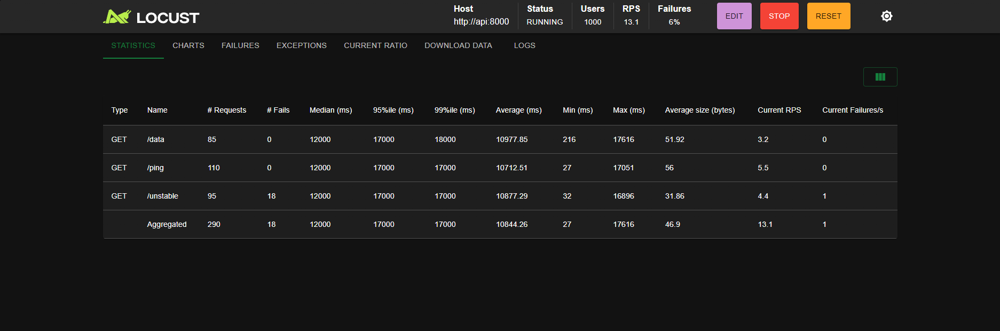
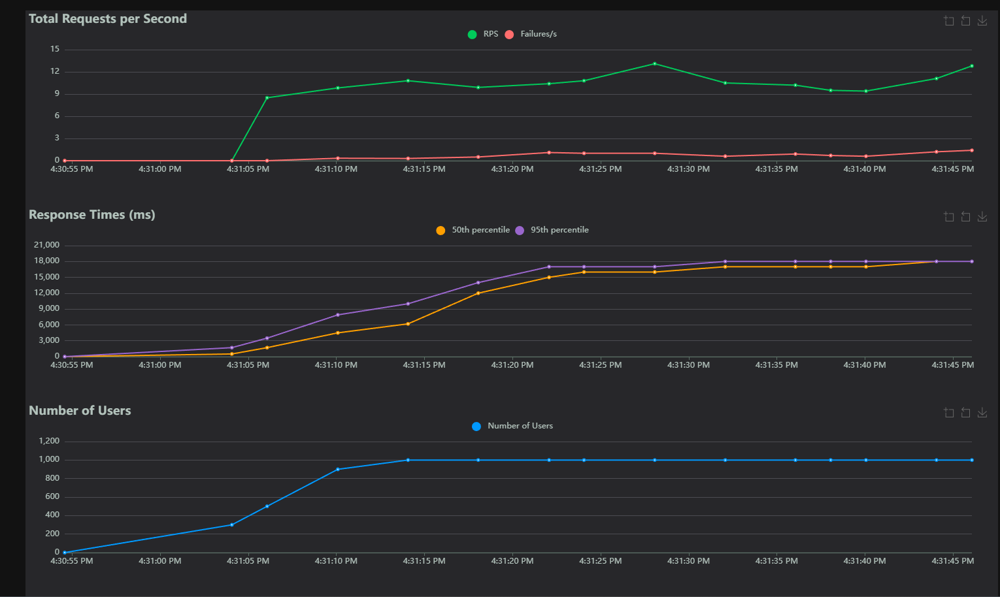

# API Load Testing & User Simulation with Locust

This project features load and performance testing of a **FastAPI REST API** simulating a basic social media server. It uses **Locust** to simulate concurrency. 

To mimic realistic user behavior, the test suite parses historical server access logs (`logs.txt`) to build a **Markov Chain transition probability matrix**, which dictates the tasks simulated users execute over time.

---

## Architecture & Components

The performance suite is split into two components:

### 1. Social Media API Server (`src/server/`)
A REST API written in FastAPI using SQLite:
- **Endpoints**: `/login`, `/feed`, `/post`, `/like/{post_id}`, `/follow/{user_id}`, `/profile/{user_id}`.
- **Middleware**: Custom logging middleware that records all API requests (`[user] METHOD path`) into log files.

### 2. Load Testing Suite (`locust/`)
- `client.py`: An HTTP client wrapping the REST endpoints. It implements login authentication (storing bearer tokens) and handles API payload calls.
- `extract_logs.py`: Parses access logs (`logs.txt`) using regular expressions, normalizes endpoints (e.g. `/profile/5` becomes `/profile/:id`), and outputs the **Markov Chain transition probability matrix**.
- `locustfile_markov.py`: Defines a Locust `HttpUser` that uses the parsed Markov chain probabilities to decide what API request to execute next based on its current state (e.g. if a user is on `/feed`, they have a $30\%$ chance to go to `/profile` and $70\%$ to stay on `/feed`).
- `locustfile_global.py`: Runs a standard load test with fixed global weights rather than transition chains.

---

## How to Run

### 1. Start the API Server
Install requirements:
```bash
pip install fastapi uvicorn locust pydantic
```

Run the server locally on port 8080:
```bash
cd src/server/
python main.py
```

### 2. Generate the Markov Matrix
To analyze the logs and print the calculated transition probabilities:
```bash
cd locust/
python extract_logs.py
```

### 3. Launch Locust Load Testing
To run the simulated users:
```bash
cd locust/
locust -f locustfile_markov.py --host=http://127.0.0.1:8080
```

Open the Locust Web UI at `http://localhost:8089` to configure the user count, spawn rate, and view real-time latency graphs, fails/s, and RPS (Requests Per Second).

---

## Load Testing Performance Results

During our stress tests, we scaled the simulation up to **1,000 concurrent users** to analyze the REST API's limits and behavior under heavy load.

### 1. Request Statistics
The Statistics panel details the request distribution, median/95th/99th percentile response latencies, and failures per endpoint:



### 2. Response Charts & User Ramping
Below are the real-time execution graphs showing the total Requests Per Second (RPS) vs. failures, response time percentiles, and the user spawning ramp-up timeline up to 1,000 users:



